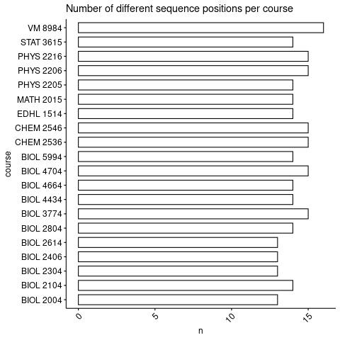

# midfield

## Exploring the tables

```{r load-midfield-libraries-and-data, echo=TRUE, message=FALSE, warning=FALSE}
knitr::opts_chunk$set(tidy = TRUE, cache = TRUE, message = FALSE, error = TRUE)
library(tidyverse, quietly = TRUE)
library(formatR)
library(magrittr, quietly = TRUE)
library(midfielddata)
library(tictoc)
library(parallel)
library(visNetwork)
library(tidygraph)
library(ggpubr)


# yay parallelism!
# leave a core out for system responsiveness and load in a few libraries
library(multidplyr)
cluster <- new_cluster(detectCores() - 1)
cluster_library(cluster, "dplyr")
cluster_library(cluster, "stringr")
cluster_library(cluster, "tidygraph")
cluster_library(cluster, "forcats")
cluster_library(cluster, "tidyr")
cluster_library(cluster, "magrittr")

data(course, degree, term, package = "midfielddata")
```

## Define some data sets
### Major cip codes {.tabset}

I'll be just using earth science cip codes until we have a list of biology cips. It's /possible/ to use a shiny app to compute stuff interactively but that would require a good deal more work and being hosted off of Tim's home server so it'll be slow to load.

#### Computing

```{r}
computing_dhs_cips <- c(
  110101, 110102, 110103, 110104, 110199, 110201, 110202, 110203,
  110299, 110301, 110401, 110501, 110701, 110801, 110802, 110803,
  110804, 110899, 110901, 111001, 111002, 111003, 111004, 111005,
  111006, 111099, 140900, 140901, 140902, 140903, 140999, 151201,
  151202, 151203, 151204, 151299, 151301
)
```

#### Earth Sciences
```{r}
geo_dhs_cips <- c(
  140802, 142100, 142101, 142500, 142501, 143900, 143901, 150901,
  150903, 150999, 400600, 400601, 400602, 400603, 400604, 400605,
  400606, 400607, 400699, 450702
)
```

#### Life Sciences

```{r}
core_biology_dhs_cips <- c(
  011203, 260100, 260101, 260102, 260200, 260202, 260203, 260204,
  260205, 260206, 260207, 260208, 260209, 260210, 260299, 260300,
  260301, 260305, 260307, 260308, 260399, 260400, 260401, 260403,
  260404, 260406, 260407, 260499, 260500, 260502, 260503, 260504,
  260505, 260506, 260507, 260508, 260509, 260599, 260700, 260701,
  260702, 260707, 260708, 260709, 260799, 260800, 260801, 260802,
  260803, 260804, 260805, 260806, 260807, 260899, 260900, 260901,
  260902, 260903, 260904, 260905, 260907, 260908, 260909, 260910,
  260911, 260912, 260913, 260999, 261000, 261001, 261002, 261003,
  261004, 261005, 261006, 261007, 261099, 261100, 261101, 261102,
  261103, 261104, 261199, 261200, 261201, 261300, 261301, 261302,
  261303, 261304, 261305, 261306, 261307, 261308, 261309, 261310,
  261311, 261399, 261400, 261401, 261500, 261501, 261502, 261503,
  261504, 261599, 269900, 269999, 270306, 300101, 300601, 301001,
  302701)

applied_biology_dhs_cips <- c(
  010901, 010902, 010903, 010904, 010905, 010906, 010907, 010999,
  011001, 011002, 011099, 011101, 011102, 011103, 011104, 011105,
  011106, 011199, 018105, 018106, 018107, 018108, 018109, 018110,
  018111, 030101, 030103, 030104, 030199, 030205, 030502, 030508,
  030509, 030601, 140300, 140301, 140500, 140501, 141400, 141401,
  143401, 144300, 144301, 144500, 144501, 150507, 301701, 301901,
  302501, 410101, 511005, 511401)
```

```{r, include=FALSE}
cips_of_interest <- core_biology_dhs_cips
```

### Names for cip codes

This might come in handy I dunno

If this block gets annoying: https://bookdown.org/yihui/rmarkdown-cookbook/html-scroll.html
```{r}
stem_cip_names <- c(
  "010308" = "Agroecology and Sustainable Agriculture",
  "010901" = "Animal Sciences, General",
  "010902" = "Agricultural Animal Breeding",
  "010903" = "Animal Health",
  "010904" = "Animal Nutrition",
  "010905" = "Dairy Science",
  "010906" = "Livestock Management",
  "010907" = "Poultry Science",
  "010999" = "Animal Sciences, Other",
  "011001" = "Food Science",
  "011002" = "Food Technology and Processing",
  "011099" = "Food Science and Technology, Other",
  "011101" = "Plant Sciences, General",
  "011102" = "Agronomy and Crop Science",
  "011103" = "Horticultural Science",
  "011104" = "Agricultural and Horticultural Plant Breeding",
  "011105" = "Plant Protection and Integrated Pest Management",
  "011106" = "Range Science and Management",
  "011199" = "Plant Sciences, Other",
  "011201" = "Soil Science and Agronomy, General",
  "011202" = "Soil Chemistry and Physics",
  "011203" = "Soil Microbiology",
  "011299" = "Soil Sciences, Other",
  "018105" = "Veterinary Anatomy",
  "018106" = "Veterinary Infectious Diseases",
  "018107" = "Veterinary Microbiology and Immunobiology",
  "018108" = "Veterinary Pathology and Pathobiology",
  "018109" = "Veterinary Physiology",
  "018110" = "Veterinary Preventive Medicine, Epidemiology, and Public Health",
  "018111" = "Veterinary Toxicology and Pharmacology",
  "030101" = "Natural Resources/Conservation, General",
  "030103" = "Environmental Studies",
  "030104" = "Environmental Science",
  "030199" = "Natural Resources Conservation and Research, Other",
  "030205" = "Water, Wetlands, and Marine Resources Management",
  "030210" = "Bioenergy",
  "030501" = "Forestry, General",
  "030502" = "Forest Sciences and Biology",
  "030508" = "Urban Forestry",
  "030509" = "Wood Science and Wood Products/Pulp and Paper Technology/Technician",
  "030510" = "Forest Resources Production and Management",
  "030601" = "Wildlife, Fish and Wildlands Science and Management",
  "040902" = "Architectural and Building Sciences/Technology",
  "090702" = "Digital Communication and Media/Multimedia",
  "100304" = "Animation, Interactive Technology, Video Graphics, and Special Effects",
  "110101" = "Computer and Information Sciences, General",
  "110102" = "Artificial Intelligence",
  "110103" = "Information Technology",
  "110104" = "Informatics",
  "110105" = "Human-Centered Technology Design",
  "110199" = "Computer and Information Sciences, Other",
  "110201" = "Computer Programming/Programmer, General",
  "110202" = "Computer Programming, Specific Applications",
  "110203" = "Computer Programming, Vendor/Product Certification",
  "110299" = "Computer Programming, Other",
  "110301" = "Data Processing and Data Processing Technology/ Technician",
  "110401" = "Information Science/Studies",
  "110501" = "Computer Systems Analysis/Analyst",
  "110701" = "Computer Science",
  "110801" = "Web Page, Digital/Multimedia and Information Resources Design",
  "110802" = "Data Modeling/Warehousing and Database Administration",
  "110803" = "Computer Graphics",
  "110804" = "Modeling, Virtual Environments and Simulation",
  "110899" = "Computer Software and Media Applications, Other",
  "110901" = "Computer Systems Networking and Telecommunications",
  "110902" = "Cloud Computing",
  "111001" = "Network and System Administration/Administrator",
  "111002" = "System, Networking, and LAN/WAN Management/Manager",
  "111003" = "Computer and Information Systems Security/Auditing/Information Assurance",
  "111004" = "Web/Multimedia Management and Webmaster",
  "111005" = "Information Technology Project Management",
  "111006" = "Computer Support Specialist",
  "111099" = "Computer/Information Technology Services Administration and Management, Other",
  "130501" = "Educational/Instructional Technology",
  "130601" = "Educational Evaluation and Research",
  "130603" = "Educational Statistics and Research Methods",
  "140000" = "ENGINEERING",
  "140100" = "Engineering, General",
  "140101" = "Engineering, General",
  "140102" = "Pre-Engineering",
  "140103" = "Applied Engineering",
  "140200" = "Aerospace, Aeronautical, and Astronautical/Space Engineering",
  "140201" = "Aerospace, Aeronautical, and Astronautical/Space Engineering, General",
  "140202" = "Astronautical Engineering",
  "140299" = "Aerospace, Aeronautical, and Astronautical/Space Engineering, Other",
  "140300" = "Agricultural Engineering",
  "140301" = "Agricultural Engineering",
  "140400" = "Architectural Engineering",
  "140401" = "Architectural Engineering",
  "140500" = "Biomedical/Medical Engineering",
  "140501" = "Bioengineering and Biomedical Engineering",
  "140600" = "Ceramic Sciences and Engineering",
  "140601" = "Ceramic Sciences and Engineering",
  "140700" = "Chemical Engineering",
  "140701" = "Chemical Engineering",
  "140702" = "Chemical and Biomolecular Engineering",
  "140799" = "Chemical Engineering, Other",
  "140800" = "Civil Engineering",
  "140801" = "Civil Engineering, General",
  "140802" = "Geotechnical and Geoenvironmental Engineering",
  "140803" = "Structural Engineering",
  "140804" = "Transportation and Highway Engineering",
  "140805" = "Water Resources Engineering",
  "140899" = "Civil Engineering, Other",
  "140900" = "Computer Engineering",
  "140901" = "Computer Engineering, General",
  "140902" = "Computer Hardware Engineering",
  "140903" = "Computer Software Engineering",
  "140999" = "Computer Engineering, Other",
  "141000" = "Electrical, Electronics, and Communications Engineering",
  "141001" = "Electrical and Electronics Engineering",
  "141003" = "Laser and Optical Engineering",
  "141004" = "Telecommunications Engineering",
  "141099" = "Electrical, Electronics, and Communications Engineering, Other",
  "141100" = "Engineering Mechanics",
  "141101" = "Engineering Mechanics",
  "141200" = "Engineering Physics",
  "141201" = "Engineering Physics/Applied Physics",
  "141300" = "Engineering Science",
  "141301" = "Engineering Science",
  "141400" = "Environmental/Environmental Health Engineering",
  "141401" = "Environmental/Environmental Health Engineering",
  "141800" = "Materials Engineering",
  "141801" = "Materials Engineering",
  "141900" = "Mechanical Engineering",
  "141901" = "Mechanical Engineering",
  "142000" = "Metallurgical Engineering",
  "142001" = "Metallurgical Engineering",
  "142100" = "Mining and Mineral Engineering",
  "142101" = "Mining and Mineral Engineering",
  "142200" = "Naval Architecture and Marine Engineering",
  "142201" = "Naval Architecture and Marine Engineering",
  "142300" = "Nuclear Engineering",
  "142301" = "Nuclear Engineering",
  "142400" = "Ocean Engineering",
  "142401" = "Ocean Engineering",
  "142500" = "Petroleum Engineering",
  "142501" = "Petroleum Engineering",
  "142700" = "Systems Engineering",
  "142701" = "Systems Engineering",
  "142800" = "Textile Sciences and Engineering",
  "142801" = "Textile Sciences and Engineering",
  "143200" = "Polymer/Plastics Engineering",
  "143201" = "Polymer/Plastics Engineering",
  "143300" = "Construction Engineering",
  "143301" = "Construction Engineering",
  "143400" = "Forest Engineering",
  "143401" = "Forest Engineering",
  "143500" = "Industrial Engineering",
  "143501" = "Industrial Engineering",
  "143600" = "Manufacturing Engineering",
  "143601" = "Manufacturing Engineering",
  "143700" = "Operations Research",
  "143701" = "Operations Research",
  "143800" = "Surveying Engineering",
  "143801" = "Surveying Engineering",
  "143900" = "Geological/Geophysical Engineering",
  "143901" = "Geological/Geophysical Engineering",
  "144000" = "Paper Science and Engineering",
  "144001" = "Paper Science and Engineering",
  "144100" = "Electromechanical Engineering",
  "144101" = "Electromechanical Engineering",
  "144200" = "Mechatronics, Robotics, and Automation Engineering",
  "144201" = "Mechatronics, Robotics, and Automation Engineering",
  "144300" = "Biochemical Engineering",
  "144301" = "Biochemical Engineering",
  "144400" = "Engineering Chemistry",
  "144401" = "Engineering Chemistry",
  "144500" = "Biological/Biosystems Engineering",
  "144501" = "Biological/Biosystems Engineering",
  "144700" = "Electrical and Computer Engineering",
  "144701" = "Electrical and Computer Engineering",
  "144800" = "Energy Systems Engineering",
  "144801" = "Energy Systems Engineering, General",
  "144802" = "Power Plant Engineering",
  "144899" = "Energy Systems Engineering, Other",
  "149900" = "Engineering, Other",
  "149999" = "Engineering, Other",
  "150000" = "Engineering Technologies/Technicians, General",
  "150101" = "Architectural Engineering Technologies/Technicians",
  "150201" = "Civil Engineering Technologies/Technicians",
  "150303" = "Electrical, Electronic, and Communications Engineering Technology/Technician",
  "150304" = "Laser and Optical Technology/Technician",
  "150305" = "Telecommunications Technology/Technician",
  "150306" = "Integrated Circuit Design Technology/Technician",
  "150399" = "Electrical/Electronic Engineering Technologies/Technicians, Other",
  "150401" = "Biomedical Technology/Technician",
  "150403" = "Electromechanical/Electromechanical Engineering Technology/Technician",
  "150404" = "Instrumentation Technology/Technician",
  "150405" = "Robotics Technology/Technician",
  "150406" = "Automation Engineer Technology/Technician",
  "150499" = "Electromechanical Technologies/Technicians, Other",
  "150501" = "Heating, Ventilation, Air Conditioning and Refrigeration Engineering Technology/Technician",
  "150506" = "Water Quality and Wastewater Treatment Management and Recycling Technology/Technician",
  "150507" = "Environmental/Environmental Engineering Technology/Technician",
  "150508" = "Hazardous Materials Management and Waste Technology/Technician",
  "150599" = "Environmental Control Technologies/Technicians, Other",
  "150607" = "Plastics and Polymer Engineering Technology/Technician",
  "150611" = "Metallurgical Technology/Technician",
  "150612" = "Industrial Technology/Technician",
  "150613" = "Manufacturing Engineering Technology/Technician",
  "150614" = "Welding Engineering Technology/Technician",
  "150615" = "Chemical Engineering Technology/Technician",
  "150616" = "Semiconductor Manufacturing Technology/Technician",
  "150699" = "Industrial Production Technologies/Technicians, Other",
  "150701" = "Occupational Safety and Health Technology/Technician",
  "150702" = "Quality Control Technology/Technician",
  "150703" = "Industrial Safety Technology/Technician",
  "150704" = "Hazardous Materials Information Systems Technology/Technician",
  "150799" = "Quality Control and Safety Technologies/Technicians, Other",
  "150801" = "Aeronautical/Aerospace Engineering Technology/Technician",
  "150803" = "Automotive Engineering Technology/Technician",
  "150805" = "Mechanical/Mechanical Engineering Technology/Technician",
  "150899" = "Mechanical Engineering Related Technologies/Technicians, Other",
  "150901" = "Mining Technology/Technician",
  "150903" = "Petroleum Technology/Technician",
  "150999" = "Mining and Petroleum Technologies/Technicians, Other",
  "151001" = "Construction Engineering Technology/Technician",
  "151102" = "Surveying Technology/Surveying",
  "151103" = "Hydraulics and Fluid Power Technology/Technician",
  "151199" = "Engineering-Related Technologies/Technicians, Other",
  "151201" = "Computer Engineering Technology/Technician",
  "151202" = "Computer/Computer Systems Technology/Technician",
  "151203" = "Computer Hardware Technology/Technician",
  "151204" = "Computer Software Technology/Technician",
  "151299" = "Computer Engineering Technologies/Technicians, Other",
  "151301" = "Drafting and Design Technology/Technician, General",
  "151302" = "CAD/CADD Drafting and/or Design Technology/Technician",
  "151303" = "Architectural Drafting and Architectural CAD/CADD",
  "151304" = "Civil Drafting and Civil Engineering CAD/CADD",
  "151305" = "Electrical/Electronics Drafting and Electrical/Electronics CAD/CADD",
  "151306" = "Mechanical Drafting and Mechanical Drafting CAD/CADD",
  "151399" = "Drafting/Design Engineering Technologies/Technicians, Other",
  "151401" = "Nuclear Engineering Technology/Technician",
  "151501" = "Engineering/Industrial Management",
  "151502" = "Engineering Design",
  "151503" = "Packaging Science",
  "151599" = "Engineering-Related Fields, Other",
  "151601" = "Nanotechnology",
  "151701" = "Energy Systems Technology/Technician",
  "151703" = "Solar Energy Technology/Technician",
  "159999" = "Engineering/Engineering-Related Technologies/Technicians, Other",
  "260000" = "BIOLOGICAL AND BIOMEDICAL SCIENCES",
  "260100" = "Biology, General",
  "260101" = "Biology/Biological Sciences, General",
  "260102" = "Biomedical Sciences, General",
  "260200" = "Biochemistry, Biophysics and Molecular Biology",
  "260202" = "Biochemistry",
  "260203" = "Biophysics",
  "260204" = "Molecular Biology",
  "260205" = "Molecular Biochemistry",
  "260206" = "Molecular Biophysics",
  "260207" = "Structural Biology",
  "260208" = "Photobiology",
  "260209" = "Radiation Biology/Radiobiology",
  "260210" = "Biochemistry and Molecular Biology",
  "260299" = "Biochemistry, Biophysics and Molecular Biology, Other",
  "260300" = "Botany/Plant Biology",
  "260301" = "Botany/Plant Biology",
  "260305" = "Plant Pathology/Phytopathology",
  "260307" = "Plant Physiology",
  "260308" = "Plant Molecular Biology",
  "260399" = "Botany/Plant Biology, Other",
  "260400" = "Cell/Cellular Biology and Anatomical Sciences",
  "260401" = "Cell/Cellular Biology and Histology",
  "260403" = "Anatomy",
  "260404" = "Developmental Biology and Embryology",
  "260406" = "Cell/Cellular and Molecular Biology",
  "260407" = "Cell Biology and Anatomy",
  "260499" = "Cell/Cellular Biology and Anatomical Sciences, Other",
  "260500" = "Microbiological Sciences and Immunology",
  "260502" = "Microbiology, General",
  "260503" = "Medical Microbiology and Bacteriology",
  "260504" = "Virology",
  "260505" = "Parasitology",
  "260506" = "Mycology",
  "260507" = "Immunology",
  "260508" = "Microbiology and Immunology",
  "260509" = "Infectious Disease and Global Health",
  "260599" = "Microbiological Sciences and Immunology, Other",
  "260700" = "Zoology/Animal Biology",
  "260701" = "Zoology/Animal Biology",
  "260702" = "Entomology",
  "260707" = "Animal Physiology",
  "260708" = "Animal Behavior and Ethology",
  "260709" = "Wildlife Biology",
  "260799" = "Zoology/Animal Biology, Other",
  "260800" = "Genetics",
  "260801" = "Genetics, General",
  "260802" = "Molecular Genetics",
  "260803" = "Microbial and Eukaryotic Genetics",
  "260804" = "Animal Genetics",
  "260805" = "Plant Genetics",
  "260806" = "Human/Medical Genetics",
  "260807" = "Genome Sciences/Genomics",
  "260899" = "Genetics, Other",
  "260900" = "Physiology, Pathology and Related Sciences",
  "260901" = "Physiology, General",
  "260902" = "Molecular Physiology",
  "260903" = "Cell Physiology",
  "260904" = "Endocrinology",
  "260905" = "Reproductive Biology",
  "260907" = "Cardiovascular Science",
  "260908" = "Exercise Physiology and Kinesiology",
  "260909" = "Vision Science/Physiological Optics",
  "260910" = "Pathology/Experimental Pathology",
  "260911" = "Oncology and Cancer Biology",
  "260912" = "Aerospace Physiology and Medicine",
  "260913" = "Biomechanics",
  "260999" = "Physiology, Pathology, and Related Sciences, Other",
  "261000" = "Pharmacology and Toxicology",
  "261001" = "Pharmacology",
  "261002" = "Molecular Pharmacology",
  "261003" = "Neuropharmacology",
  "261004" = "Toxicology",
  "261005" = "Molecular Toxicology",
  "261006" = "Environmental Toxicology",
  "261007" = "Pharmacology and Toxicology",
  "261099" = "Pharmacology and Toxicology, Other",
  "261100" = "Biomathematics, Bioinformatics, and Computational Biology",
  "261101" = "Biometry/Biometrics",
  "261102" = "Biostatistics",
  "261103" = "Bioinformatics",
  "261104" = "Computational Biology",
  "261199" = "Biomathematics, Bioinformatics, and Computational Biology, Other",
  "261200" = "Biotechnology",
  "261201" = "Biotechnology",
  "261300" = "Ecology, Evolution, Systematics, and Population Biology",
  "261301" = "Ecology",
  "261302" = "Marine Biology and Biological Oceanography",
  "261303" = "Evolutionary Biology",
  "261304" = "Aquatic Biology/Limnology",
  "261305" = "Environmental Biology",
  "261306" = "Population Biology",
  "261307" = "Conservation Biology",
  "261308" = "Systematic Biology/Biological Systematics",
  "261309" = "Epidemiology",
  "261310" = "Ecology and Evolutionary Biology",
  "261311" = "Epidemiology and Biostatistics",
  "261399" = "Ecology, Evolution, Systematics and Population Biology, Other",
  "261400" = "Molecular Medicine",
  "261401" = "Molecular Medicine",
  "261500" = "Neurobiology and Neurosciences",
  "261501" = "Neuroscience",
  "261502" = "Neuroanatomy",
  "261503" = "Neurobiology and Anatomy",
  "261504" = "Neurobiology and Behavior",
  "261599" = "Neurobiology and Neurosciences, Other",
  "269900" = "Biological and Biomedical Sciences, Other",
  "269999" = "Biological and Biomedical Sciences, Other",
  "270000" = "MATHEMATICS AND STATISTICS",
  "270100" = "Mathematics",
  "270101" = "Mathematics, General",
  "270102" = "Algebra and Number Theory",
  "270103" = "Analysis and Functional Analysis",
  "270104" = "Geometry/Geometric Analysis",
  "270105" = "Topology and Foundations",
  "270199" = "Mathematics, Other",
  "270300" = "Applied Mathematics",
  "270301" = "Applied Mathematics, General",
  "270303" = "Computational Mathematics",
  "270304" = "Computational and Applied Mathematics",
  "270305" = "Financial Mathematics",
  "270306" = "Mathematical Biology",
  "270399" = "Applied Mathematics, Other",
  "270500" = "Statistics",
  "270501" = "Statistics, General",
  "270502" = "Mathematical Statistics and Probability",
  "270503" = "Mathematics and Statistics",
  "270599" = "Statistics, Other",
  "270600" = "Applied Statistics",
  "270601" = "Applied Statistics, General",
  "279900" = "Mathematics and Statistics, Other",
  "279999" = "Mathematics and Statistics, Other",
  "280501" = "Air Science/Airpower Studies",
  "280502" = "Air and Space Operational Art and Science",
  "280505" = "Naval Science and Operational Studies",
  "290201" = "Intelligence, General",
  "290202" = "Strategic Intelligence",
  "290203" = "Signal/Geospatial Intelligence",
  "290204" = "Command &Control (C3, C4I) Systems and Operations",
  "290205" = "Information Operations/Joint Information Operations",
  "290206" = "Information/Psychological Warfare and Military Media Relations",
  "290207" = "Cyber/Electronic Operations and Warfare",
  "290299" = "Intelligence, Command Control and Information Operations, Other",
  "290301" = "Combat Systems Engineering",
  "290302" = "Directed Energy Systems",
  "290303" = "Engineering Acoustics",
  "290304" = "Low-Observables and Stealth Technology",
  "290305" = "Space Systems Operations",
  "290306" = "Operational Oceanography",
  "290307" = "Undersea Warfare",
  "290399" = "Military Applied Sciences, Other",
  "290401" = "Aerospace Ground Equipment Technology",
  "290402" = "Air and Space Operations Technology",
  "290403" = "Aircraft Armament Systems Technology",
  "290404" = "Explosive Ordinance/Bomb Disposal",
  "290405" = "Joint Command/Task Force (C3, C4I) Systems",
  "290406" = "Military Information Systems Technology",
  "290407" = "Missile and Space Systems Technology",
  "290408" = "Munitions Systems/Ordinance Technology",
  "290409" = "Radar Communications and Systems Technology",
  "290499" = "Military Systems and Maintenance Technology, Other",
  "299999" = "Military Technologies and Applied Sciences, Other",
  "300101" = "Biological and Physical Sciences",
  "300601" = "Systems Science and Theory",
  "300801" = "Mathematics and Computer Science",
  "301001" = "Biopsychology",
  "301701" = "Behavioral Sciences",
  "301801" = "Natural Sciences",
  "301901" = "Nutrition Sciences",
  "302501" = "Cognitive Science, General",
  "302701" = "Human Biology",
  "303001" = "Computational Science",
  "303101" = "Human Computer Interaction",
  "303201" = "Marine Sciences",
  "303301" = "Sustainability Studies",
  "303401" = "Anthrozoology",
  "303501" = "Climate Science",
  "303801" = "Earth Systems Science",
  "303901" = "Economics and Computer Science",
  "304101" = "Environmental Geosciences",
  "304301" = "Geobiology",
  "304401" = "Geography and Environmental Studies",
  "304901" = "Mathematical Economics",
  "305001" = "Mathematics and Atmospheric/Oceanic Science",
  "307001" = "Data Science, General",
  "307101" = "Data Analytics, General",
  "307102" = "Business Analytics",
  "307103" = "Data Visualization",
  "307104" = "Financial Analytics",
  "307199" = "Data Analytics, Other",
  "400000" = "PHYSICAL SCIENCES",
  "400100" = "Physical Sciences, General",
  "400101" = "Physical Sciences, General",
  "400200" = "Astronomy and Astrophysics",
  "400201" = "Astronomy",
  "400202" = "Astrophysics",
  "400203" = "Planetary Astronomy and Science",
  "400299" = "Astronomy and Astrophysics, Other",
  "400400" = "Atmospheric Sciences and Meteorology",
  "400401" = "Atmospheric Sciences and Meteorology, General",
  "400402" = "Atmospheric Chemistry and Climatology",
  "400403" = "Atmospheric Physics and Dynamics",
  "400404" = "Meteorology",
  "400499" = "Atmospheric Sciences and Meteorology, Other",
  "400500" = "Chemistry",
  "400501" = "Chemistry, General",
  "400502" = "Analytical Chemistry",
  "400503" = "Inorganic Chemistry",
  "400504" = "Organic Chemistry",
  "400506" = "Physical Chemistry",
  "400507" = "Polymer Chemistry",
  "400508" = "Chemical Physics",
  "400509" = "Environmental Chemistry",
  "400510" = "Forensic Chemistry",
  "400511" = "Theoretical Chemistry",
  "400512" = "Cheminformatics/Chemistry Informatics",
  "400599" = "Chemistry, Other",
  "400600" = "Geological and Earth Sciences/Geosciences",
  "400601" = "Geology/Earth Science, General",
  "400602" = "Geochemistry",
  "400603" = "Geophysics and Seismology",
  "400604" = "Paleontology",
  "400605" = "Hydrology and Water Resources Science",
  "400606" = "Geochemistry and Petrology",
  "400607" = "Oceanography, Chemical and Physical",
  "400699" = "Geological and Earth Sciences/Geosciences, Other",
  "400800" = "Physics",
  "400801" = "Physics, General",
  "400802" = "Atomic/Molecular Physics",
  "400804" = "Elementary Particle Physics",
  "400805" = "Plasma and High-Temperature Physics",
  "400806" = "Nuclear Physics",
  "400807" = "Optics/Optical Sciences",
  "400808" = "Condensed Matter and Materials Physics",
  "400809" = "Acoustics",
  "400810" = "Theoretical and Mathematical Physics",
  "400899" = "Physics, Other",
  "401000" = "Materials Sciences",
  "401001" = "Materials Science",
  "401002" = "Materials Chemistry",
  "401099" = "Materials Sciences, Other",
  "401100" = "Physics and Astronomy",
  "401101" = "Physics and Astronomy",
  "409900" = "Physical Sciences, Other",
  "409999" = "Physical Sciences, Other",
  "410000" = "Science Technologies/Technicians, General",
  "410101" = "Biology/Biotechnology Technology/Technician",
  "410204" = "Industrial Radiologic Technology/Technician",
  "410205" = "Nuclear/Nuclear Power Technology/Technician",
  "410299" = "Nuclear and Industrial Radiologic Technologies/Technicians, Other",
  "410301" = "Chemical Technology/Technician",
  "410303" = "Chemical Process Technology",
  "410399" = "Physical Science Technologies/Technicians, Other",
  "419999" = "Science Technologies/Technicians, Other",
  "422701" = "Cognitive Psychology and Psycholinguistics",
  "422702" = "Comparative Psychology",
  "422703" = "Developmental and Child Psychology",
  "422704" = "Experimental Psychology",
  "422705" = "Personality Psychology",
  "422706" = "Behavioral Neuroscience",
  "422707" = "Social Psychology",
  "422708" = "Psychometrics and Quantitative Psychology",
  "422709" = "Psychopharmacology",
  "422799" = "Research and Experimental Psychology, Other",
  "422804" = "Industrial and Organizational Psychology",
  "430403" = "Cyber/Computer Forensics and Counterterrorism",
  "430406" = "Forensic Science and Technology",
  "450102" = "Social Sciences, Research Methodology and Quantitative Methods",
  "450301" = "Archeology",
  "450603" = "Econometrics and Quantitative Economics",
  "450702" = "Geographic Information Science and Cartography",
  "490101" = "Aeronautics/Aviation/Aerospace Science and Technology, General",
  "511002" = "Cytotechnology/Cytotechnologist",
  "511005" = "Clinical Laboratory Science/Medical Technology/Technologist",
  "511401" = "Medical Science/Scientist",
  "512003" = "Pharmaceutics and Drug Design",
  "512004" = "Medicinal and Pharmaceutical Chemistry",
  "512005" = "Natural Products Chemistry and Pharmacognosy",
  "512006" = "Clinical and Industrial Drug Development",
  "512007" = "Pharmacoeconomics/Pharmaceutical Economics",
  "512009" = "Industrial and Physical Pharmacy and Cosmetic Sciences",
  "512010" = "Pharmaceutical Sciences",
  "512202" = "Environmental Health",
  "512205" = "Health/Medical Physics",
  "512706" = "Medical Informatics",
  "521301" = "Management Science",
  "521302" = "Business Statistics",
  "521304" = "Actuarial Science",
  "521399" = "Management Sciences and Quantitative Methods, Other"
)
```

## which cips have the most time in program?

okay so we've decided which cip code set we're looking at! Great!

Lets see some graphs describing our data within that set. Which cips are the most represented?
```{r}
most_represented_majors <- term %>% 
  select(mcid, cip6) %>% 
  filter(cip6 %in% cips_of_interest) %>% 
  select(cip6) %>% 
  arrange(cip6) %>% 
  group_by(cip6) %>% 
  summarise(count = n()) %>% 
  arrange(-count) 

mrm_plot <- most_represented_majors %>% 
  ggbarplot(x = "cip6", y = "count") + rotate_x_text(45)
ggexport(mrm_plot, filename = "figures/most_represented_majors.png")
knitr::include_graphics("figures/most_represented_majors.png")
```

```{r}
most_represented_major <- most_represented_majors %>% 
  head(1) %>% 
  pull(cip6)

# make a list of students who obtained this degree
students_who_graduated_major <- degree %>% 
  filter(cip6 == most_represented_major) %>% 
  select(mcid) %>% 
  unique() %>% 
  pull(mcid)

# courses taken by students in most represented major
courses_taken <- course %>%
  filter(mcid %in% students_who_graduated_major) %>%
  mutate(an = str_c(abbrev, " ", number)) %>%
  select(an) %>%
  group_by(an) %>% 
  summarise(count = n()) %>%
  arrange(-count)

courses_taken_plot <- courses_taken %>%
  head(20) %>%
  ggbarplot(x = "an", y = "count") + rotate_x_text(45)
ggexport(courses_taken_plot, filename = "figures/courses_taken.png")

```

Make a stacked bar plot to break down which relative semester each course was taken
```{r make-a-fun-tibble}
compute_semester_indicies <- function(single_student_record) {
  bar <- single_student_record %>% 
    tibble() %>% 
    mutate(term_course = as_factor(term_course)) %>% 
    mutate(semester_taken = as.integer(term_course)) %>% 
    list()
  return(bar)
}

# this is the continuous interpretation
when_courses_were_taken_discrete <- course %>%
  filter(mcid %in% students_who_graduated_major) %>%
  mutate(course = str_c(abbrev, " ", number), 
         mcid, term_course) %>%
  select(mcid, course, term_course) %>%
  nest_by(mcid) %>% 
  mutate(data = compute_semester_indicies(data)) %>% 
  unnest(cols = c(data)) %>% ungroup(mcid) %>% 
  select(course, semester_taken)

# this summarize converts our interpretation to categorical
when_courses_were_taken <- when_courses_were_taken_discrete %>%
  group_by_all() %>% 
  summarise(COUNT = n()) %>%
  ungroup()

total_counts <- when_courses_were_taken %>% 
  group_by(course) %>% 
  summarise(total_count = sum(COUNT)) %>% 
  ungroup()

when_courses_were_taken <- left_join(when_courses_were_taken,
                                       total_counts, by = "course") %>% 
  arrange(-total_count) %>% 
  mutate(semester_taken = as_factor(semester_taken))


when_bio_courses_were_taken <- when_courses_were_taken %>%
  filter(grepl("BIO", course)) 
```

```{r graph-fun-tibble}
# most taken courses stacked by what sequence position they were in
when_courses_were_taken %>% 
  filter(total_count > 100) %>%
  arrange(-COUNT) %>% 
  head(50) %>% 
  ggbarplot(x = "course", 
            y = "COUNT", 
            fill = "semester_taken") + rotate_x_text(45)

# courses with high variation of sequence position
when_courses_were_taken_barplot <- when_courses_were_taken %>%
  select(course) %>%
  group_by(course) %>% 
  summarize(n = n()) %>%
  ungroup() %>% 
  arrange(-n) %>%
  head(20) %>%
  ggbarplot(y = "course", x = "n",
            title = "Number of different sequence positions per course") + rotate_x_text(45)
ggexport(when_courses_were_taken_barplot, filename = "figures/when_courses_were_taken.png")


highly_taken_classes <- total_counts %>% 
  arrange(-total_count) %>% head(10)

when_courses_were_taken_discrete %>% 
  filter(course %in% highly_taken_classes$course & semester_taken < 10) %>%
  ggviolin(x = "course", y = "semester_taken") +
  rotate_x_text(45) + 
  grids() -> p
p <- ggpar(p, yticks.by = 1)
ggexport(p, filename = "figures/when_courses_taken_violin.png")

```


## collection of utility functions

```{r defining-utility-functions}
did_student_graduate <- function(mcid) {
  return(degree %>% filter(mcid == mcid) %>% nrow() > 0)
}

# make a table of the courses the student took by semester
format_courses <- function(single_student) {
  transcript_summary <- single_student$data[[1]] %>%
    group_by(term_course) %>% 
    mutate(p = str_c(abbrev, number, sep = " ")) %>%
    summarize(label = paste(p, collapse = "\n")) %>% 
    ungroup() %>% 
    select(label)
  return(transcript_summary)
}

# this is a version that can be passed into a mutate statement
# TODO integrate this with the non-vectorized version with a input variable check
vectorized_format_courses <- function(data) {
  transcript_summary <- data %>%
    group_by(term_course) %>% 
    mutate(p = str_c(abbrev, number, sep = " ")) %>%
    summarize(label = paste(p, collapse = "\n")) %>% 
    ungroup() %>% 
    select(label)
  return(list(transcript_summary))
}
cluster_copy(cluster, "vectorized_format_courses")
```


## Pulling student course sequences

```{r organize-student-data, cache=FALSE}
# convert to tibble
course <- tibble(course) %>% 
  select(mcid, abbrev, number, term_course) %>%
  nest_by(mcid) 

students_of_interest <- degree %>% 
  filter(cip6 %in% cips_of_interest) %>% 
  select(mcid)

student_sequences_of_interest <- course %>% 
  filter(mcid %in% students_of_interest$mcid)

single_student <- student_sequences_of_interest %>% head(1)
single_student_b <- student_sequences_of_interest %>%
  filter(mcid == "MCID3111145392")
small_sample <- student_sequences_of_interest %>% head(10) 


single_student_sequence <- format_courses(single_student)
single_student_sequence_b <- format_courses(single_student_b)
```

## Visualizing a student's course sequence

### Student level unit of analysis
```{r student graph function}
make_student_graph <- function(single_student_sequence) {
  
  make_edges <- function(single_student_sequence) {
    number_semesters <- nrow(single_student_sequence)
    return(data.frame(from = seq(number_semesters - 1), 
                      to = seq(2, number_semesters)))
  }
  make_nodes <- function(single_student_sequence) {
    number_semesters <- nrow(single_student_sequence)
    nodes <- data.frame(id = seq(number_semesters),
                        shape = "box")
    return(cbind(nodes, single_student_sequence))
  }
  
  g <- NULL
  g$nodes <- make_nodes(single_student_sequence)
  g$edges <- make_edges(single_student_sequence)
  return(g)
}
```

```{r}
# interactive simple student sequence
s <- single_student_sequence %>% make_student_graph() 
visNetwork(s$nodes, s$edges, height = "500px", width = "100%") %>% 
  visInteraction(navigationButtons = TRUE) %>%
  visEdges(arrows = 'to') %>% 
  visExport()
```

## Course level unit of analysis

```{r course graph functions}
make_course_graph <- function(single_student_record) {
  
  make_course_nodes <- function(data) {
    nodes <- data %>% 
      mutate(node_id = row_number(),
             course = str_c(abbrev, " ", number),
             term_course = as.integer(as_factor(term_course))) %>%
      select(-abbrev, -number)
    return(nodes)
  }
  
  make_course_edges <- function(data) {
    # LOTS of ways to speed this up
    nodes <- make_course_nodes(data)
    
    edges <- NULL
    for (i in seq(max(nodes$term_course) - 1)) {
      previous_course_indicies <- nodes %>% 
        select(term_course, node_id) %>%
        nest_by(term_course) %>%
        getElement(2) %>%
        getElement(i) %>%
        pull()
      subsequent_course_indicies <- nodes %>% 
        select(term_course, node_id) %>%
        nest_by(term_course) %>%
        getElement(2) %>%
        getElement(i + 1) %>%
        pull()
      if (is.null(edges)) {
        edges <- expand_grid(
          previous_course_indicies,
          subsequent_course_indicies)
      } else {
        edges <- rbind(
          edges, 
          expand_grid(
            previous_course_indicies,
            subsequent_course_indicies))
      }
    }
    edges %<>% rename(
      from = previous_course_indicies,
      to = subsequent_course_indicies)
    return(edges)
  }
  
  n <- make_course_nodes(single_student_record$data[[1]]) %>%
    select(course)
  e <- make_course_edges(single_student_record$data[[1]])
  return(tbl_graph(nodes = n, edges = e))
}

make_course_graph_vectorized <- function(data) {
  
  make_course_nodes <- function(data) {
    nodes <- data %>% 
      mutate(node_id = row_number(),
             course = str_c(abbrev, " ", number),
             term_course = as.integer(as_factor(term_course))) %>%
      select(-abbrev, -number)
    return(nodes)
  }
  
  make_course_edges <- function(data) {
    # LOTS of ways to speed this up
    nodes <- make_course_nodes(data)
    
    edges <- NULL
    for (i in seq(max(nodes$term_course) - 1)) {
      previous_course_indicies <- nodes %>% 
        select(term_course, node_id) %>%
        nest_by(term_course) %>%
        getElement(2) %>%
        getElement(i) %>%
        pull()
      subsequent_course_indicies <- nodes %>% 
        select(term_course, node_id) %>%
        nest_by(term_course) %>%
        getElement(2) %>%
        getElement(i + 1) %>%
        pull()
      if (is.null(edges)) {
        edges <- expand_grid(
          previous_course_indicies,
          subsequent_course_indicies)
      } else {
        edges <- rbind(
          edges, 
          expand_grid(
            previous_course_indicies,
            subsequent_course_indicies))
      }
    }
    edges %<>% rename(
      from = previous_course_indicies,
      to = subsequent_course_indicies)
    return(edges)
  }
  
  n <- make_course_nodes(data) %>%
    select(course)
  e <- make_course_edges(data)
  return(list(tbl_graph(nodes = n, edges = e)))
}

cluster_copy(cluster, "make_course_graph_vectorized")
```

```{r make course graph visualizations}

graph_a <- make_course_graph(single_student)
graph_b <- make_course_graph(single_student_b)

graph_c <- graph_join(graph_a, graph_b, 
                      by = join_by(course))
graph_d <- bind_graphs(graph_a, graph_b)

vis_graph_a <- toVisNetworkData(graph_a)
vis_graph_c <- toVisNetworkData(graph_c)
vis_graph_d <- toVisNetworkData(graph_d)

# a bunch of graphs
## fast igraph
# visIgraph(as.igraph(graph_c)) %>% 
#   visInteraction(navigationButtons = TRUE) %>%
#   visEdges(arrows = 'to') %>% 
#   visExport()

g <- vis_graph_a
#g$nodes %<>% filter(str_detect(course, "BIOL"))
g$nodes %<>% mutate(label = NULL, shape = "box") %>% rename(label = course)
# slow, interactive igraph
visNetwork(g$nodes, g$edges, height = "500px", width = "100%") %>% 
  visInteraction(navigationButtons = TRUE) %>%
  visEdges(arrows = 'to') %>% 
  visExport() %>% 
  visPhysics(stabilization = TRUE)

g <- vis_graph_d
#g$nodes %<>% filter(str_detect(course, "BIOL"))
g$nodes %<>% mutate(label = NULL, shape = "box") %>% rename(label = course)
# slow, interactive igraph
visNetwork(g$nodes, g$edges, height = "500px", width = "100%") %>% 
  visInteraction(navigationButtons = TRUE) %>%
  visEdges(arrows = 'to') %>% 
  visExport() %>% 
  visPhysics(stabilization = TRUE)


g <- vis_graph_c
#g$nodes %<>% filter(str_detect(course, "BIOL"))
g$nodes %<>% mutate(label = NULL, shape = "box") %>% rename(label = course)
# slow, interactive igraph
visNetwork(g$nodes, g$edges, height = "500px", width = "100%") %>% 
  visInteraction(navigationButtons = TRUE) %>%
  visEdges(arrows = 'to') %>% 
  visExport() %>% 
  visPhysics(stabilization = TRUE)
```

## compute all course sequences

### EMPLOY THE CORES
```{r compute the course sequence graph merges, cache=FALSE}
unpartitioned_course <- course
course %<>% partition(cluster)

unpartitioned_sequences <- student_sequences_of_interest
student_sequences_of_interest %<>% partition(cluster)

unpartitioned_small_sample <- small_sample
small_sample %<>% partition(cluster)

tic()

student_sequences_of_interest %<>% 
  mutate(graphs = make_course_graph_vectorized(data)) %>% 
  collect()

toc()

#write_rds(small_sample, file = "data/small_sample_graphs.rds")
write_rds(student_sequences_of_interest, file = "data/course_graphs.rds")
student_sequences_of_interest <- read_rds("data/course_graphs.rds")
```

# Merge which courses are taken in each semester

```{r}
library(furrr)
# Even when merging only 10 course graphs, it's too big to visualize
# unioning these graphs is proooobably too slow with tidygraph - consider igraph union 
# https://igraph.org/r/html/latest/union.igraph.html
# merged_sample_graph <- student_sequences_of_interest %>% 
#   ungroup() %>% 
#   select(graphs) %>% 
#   reduce(graph_join) %>%
#   reduce(graph_join)

# lets run some descriptive stats instead
```

